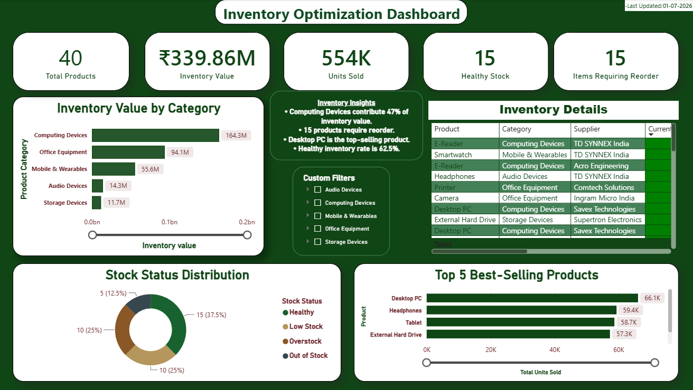
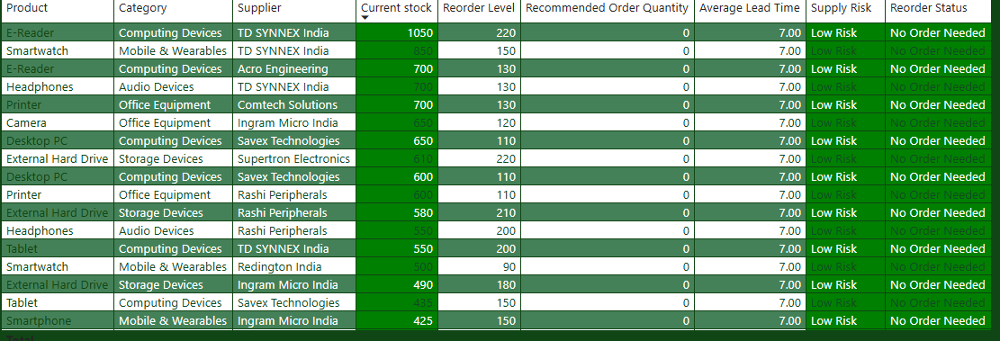
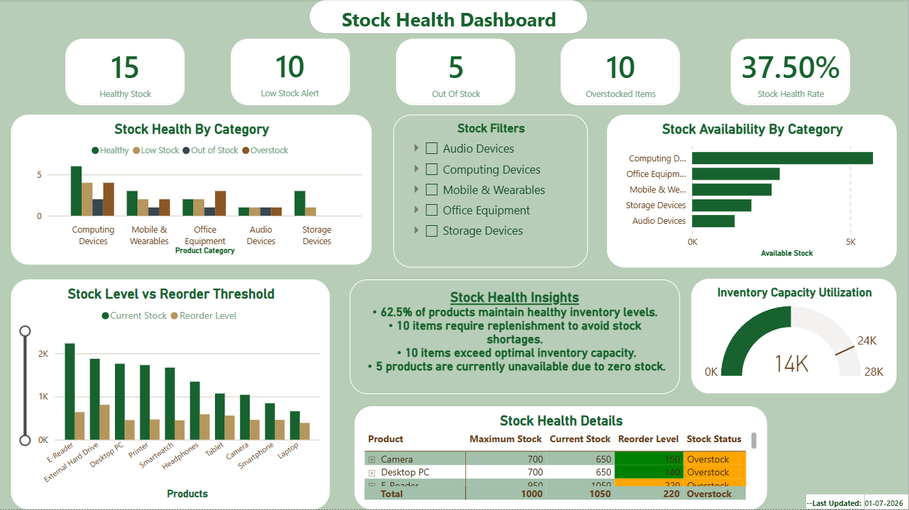
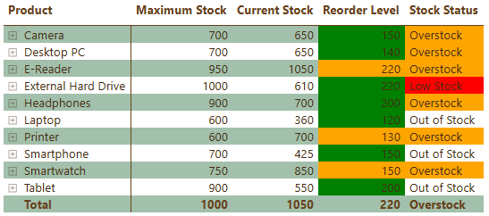
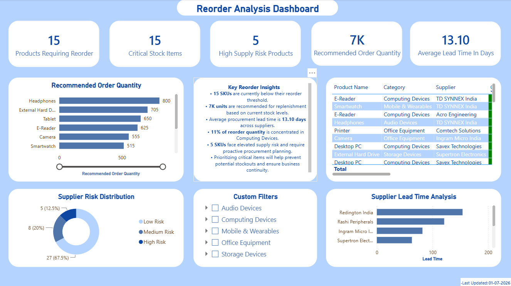
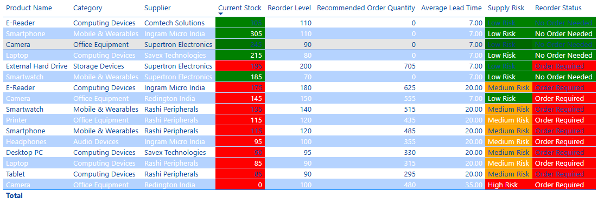
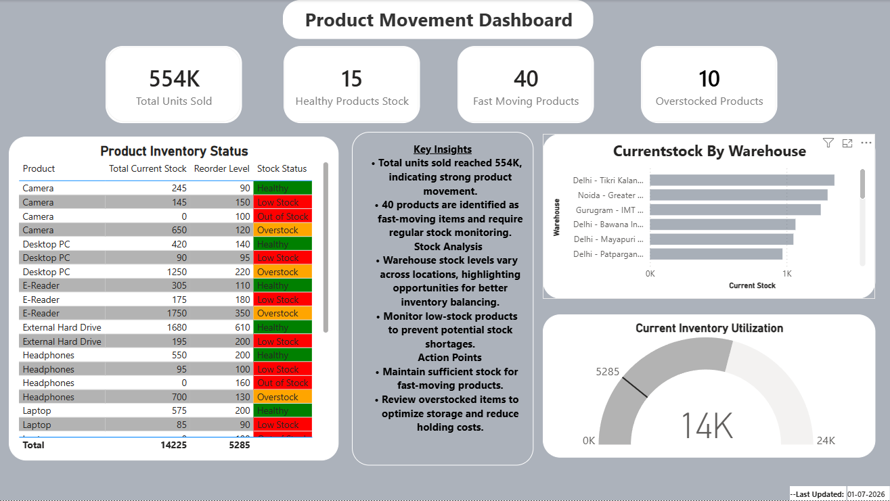
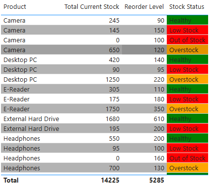

# inventory-optimization-dashboard

Inventory optimization project using Excel, PostgreSQL, and Power BI to analyze stock levels, improve inventory management, track key metrics, and create interactive dashboards for data-driven decisions.


# Inventory Optimization & Stock Management Dashboard

## Project Structure

```text
Inventory-Optimization/
│
├── 01-DATA/CLEANED/
│   │
│   ├── CSV/
│   │   ├── inventory.csv
│   │   ├── products.csv
│   │   ├── purchaseorders.csv
│   │   └── sales.csv
│   │
│   └── EXCEL/
│       └── inventory-optimization-dataset.xlsx
│
├── 02-SQL/
│   ├── 01-view-inventory_value_create.sql
│   ├── 01-view-inventory_value_queries.sql
│   │
│   ├── 02-view-stock_health_create.sql
│   ├── 02-view-stock_health_queries.sql
│   │
│   ├── 03-view-reorder_recommendations_create.sql
│   ├── 03-view-reorder_recommendations_queries.sql
│   │
│   ├── 04-view-product_movement_create.sql
│   │
│   ├── 05-view-supplier_leadtime_analysis_create.sql
│   ├── 05-view-supplier_leadtime_analysis_queries.sql
│   │
│   └── 06-view-inventory_dashboard_create.sql
│
├── 03-POWER BI/
│   └── inventory_optimization_dashboard.pbix
│
├── IMAGES/
│   ├── inventory_optimization_dashboard.png
│   ├── inventory_optimization_table.png
│   ├── stock_health_dashboard.png
│   ├── stock_health_table.png
│   ├── reorder_analysis_dashboard.png
│   ├── reorder_analysis_table.png
│   ├── product_movement_dashboard.png
│   └── product_movement_table.png
│
├── requirements.txt
└── README.md
```

### Folder Description

* **01-DATA/CLEANED/** – Contains cleaned datasets used for inventory analysis.
* **02-SQL/** – Includes SQL scripts for creating views and performing inventory analysis.
* **03-POWER BI/** – Contains the Power BI dashboard file for visualization and reporting.
* **IMAGES/** – Stores dashboard screenshots and analysis outputs.
* **requirements.txt** – Lists project dependencies.
* **README.md** – Provides project documentation and usage details.


---

# Project Overview

This project is an end-to-end **Inventory Optimization Analytics Solution** built using:

- CSV datasets
- PostgreSQL database
- SQL analytical views
- Power BI dashboards

The objective is to analyze inventory performance, identify stock risks, generate reorder recommendations, and provide business insights through interactive dashboards.

---

# Dashboard Preview

## Inventory Optimization Dashboard






## Stock Health Dashboard






## Reorder Analysis Dashboard






## Product Movement Dashboard






---

# Database Design

## Database

**PostgreSQL**

The raw CSV files were imported into PostgreSQL and transformed into analytical views for reporting.

---

# Database Tables

## 1. Inventory Table

Stores current inventory information.

| Column | Description |
|---|---|
| ProductID | Unique product identifier |
| CurrentStock | Available stock quantity |
| ReorderLevel | Minimum stock threshold |
| MaxStock | Maximum storage capacity |
| Warehouse | Storage location |
| LastRestockDate | Latest replenishment date |

---

## 2. Products Table

Contains product master information.

| Column | Description |
|---|---|
| ProductID | Product identifier |
| ProductName | Product name |
| Category | Product category |
| Brand | Product brand |
| Supplier | Supplier name |
| UnitCost | Product cost |
| SellingPrice | Selling price |

---

## 3. Purchase Orders Table

Contains purchasing information.

| Column | Description |
|---|---|
| PurchaseID | Purchase order identifier |
| ProductID | Product reference |
| OrderDate | Purchase date |
| QuantityOrdered | Ordered quantity |
| LeadTimeDays | Supplier delivery time |

---

## 4. Sales Table

Tracks product sales movement.

| Column | Description |
|---|---|
| SALE_ID | Sales transaction ID |
| ORDER_DATE | Sales date |
| PRODUCT_ID | Product reference |
| QUANTITY_SOLD | Units sold |
| CUSTOMER_ID | Customer identifier |

---

# SQL Analysis & Views

SQL views were created to transform raw tables into business-ready datasets.

## Inventory Value View

Calculates total inventory value using:

- Product cost
- Available stock
- Product details


## Stock Health View

Categorizes products into:

- Healthy Stock
- Low Stock
- Overstock


## Reorder Recommendation View

Provides:

- Products requiring reorder
- Recommended order quantity
- Supplier information


## Product Movement View

Analyzes:

- Product sales activity
- Demand patterns
- Product performance


## Supplier Lead Time Analysis View

Evaluates:

- Supplier delivery performance
- Replenishment planning


## Inventory Dashboard View

A final consolidated view created by joining analytical views and loaded into Power BI.

---

# Power BI Dashboard

The dashboard provides:

### Inventory Overview
- Total inventory value
- Current stock levels
- Product availability

### Stock Health
- Low stock identification
- Healthy inventory tracking
- Overstock monitoring

### Reorder Analysis
- Products requiring reorder
- Recommended quantities
- Supplier details

### Product Movement
- Fast-moving products
- Slow-moving products
- Sales trends

---


---

# Key Insights

This solution helps businesses:

- Prevent stock shortages
- Optimize inventory levels
- Prioritize purchase orders
- Monitor product movement
- Improve supplier planning

---

# Future Improvements

- Automated data refresh pipeline
- Demand forecasting model
- Real-time inventory alerts
- Direct database connection with Power BI

---

# Author

Rajshree Verma

Data Analytics Portfolio Project
